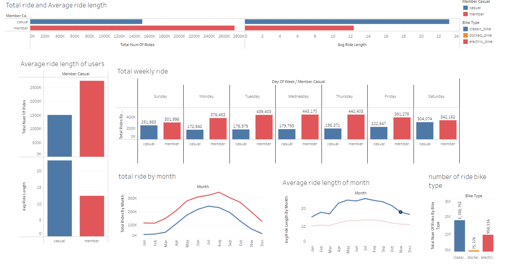

# Case Study 1: How Does a Bike-Share Navigate Speedy Success?

## Scenario
You are a junior data analyst working on the marketing analyst team at Cyclistic, a bike-share company in Chicago. The director of marketing believes the company’s future success depends on maximizing the number of annual memberships. Therefore, your team wants to understand how casual riders and annual members use Cyclistic bikes differently. From these insights, your team will design a new marketing strategy to convert casual riders into annual members. But first, Cyclistic executives must approve your recommendations, so they must be backed up with compelling data insights and professional data visualizations.

## Ask
1. How do annual members and casual riders use Cyclistic bikes differently?
2. Why would casual riders buy Cyclistic annual memberships?
3. How can Cyclistic use digital media to influence casual riders to become members?

## Tools Used in Analysis
- **Data Cleaning:** BigQuery
- **Data Analysis:** BigQuery and Microsoft Excel
- **Visualization:** Tableau Public

## Ask Phase
### Business Task
How do annual members and casual riders use Cyclistic bikes differently?

## Prepare
The data has been made available by Motivate International Inc. It is credible and reliable.
- **Data Date Range:** January 2023 - December 2023
- **Link to Data:** [Divvy Trip Data](https://divvy-tripdata.s3.amazonaws.com/index.html)

## Process
### Data Cleaning
**Excel:**
- Used Excel just to initially analyze the data and to just see through it. Since Excel cannot handle the file size, I switched over to BigQuery to be able to analyze the whole 12 datasets.
  - Combined all the data into one table.
  - Created a new column labeled `day_of_week` using (1-7).
  - Created a new column labeled `ride_length` by subtracting the `started_at` column from the `ended_at` column.

**Cleaning:**
- Removed null values.
- Removed ride lengths less than 1 min and more than 24 hrs.
- Checked for and removed any duplicates.

## Analyze
- Total number of Casual Riders vs Annual Members
- Number of rides based on Bike Type
- Average ride length of Riders by week
- Average and total ride length of riders by month
- Top 10 start stations

## Share
The dashboard I created for this project can be found on Tableau [here](https://public.tableau.com/app/profile/fraol.bekele/viz/Cyclistsridesharecasestudy/Dashboard1).

