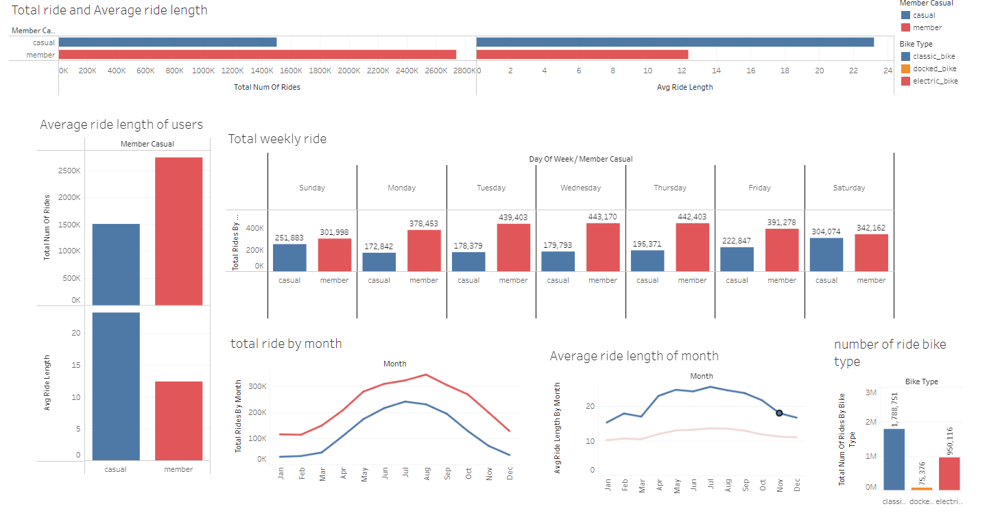
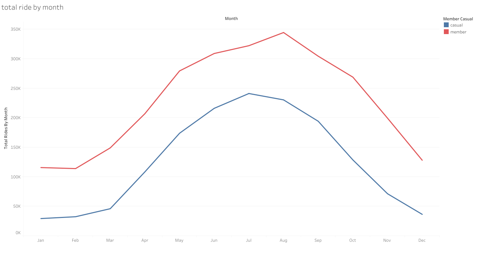
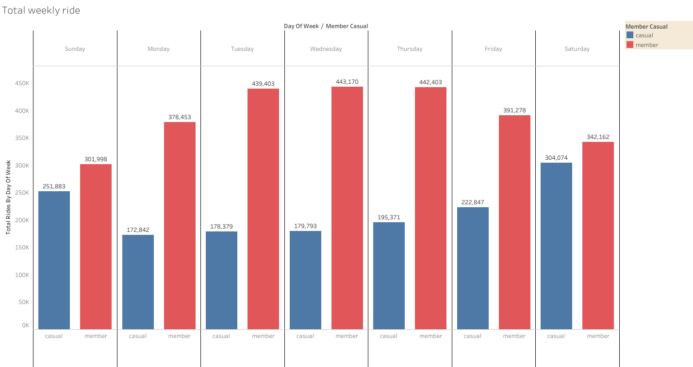

# Case Study 1: How Does a Bike-Share Navigate Speedy Success?

## Scenario
You are a junior data analyst working on the marketing analyst team at Cyclistic, a bike-share company in Chicago. The director of marketing believes the company’s future success depends on maximizing the number of annual memberships. Therefore, your team wants to understand how casual riders and annual members use Cyclistic bikes differently. From these insights, your team will design a new marketing strategy to convert casual riders into annual members. But first, Cyclistic executives must approve your recommendations, so they must be backed up with compelling data insights and professional data visualizations.

## Ask
1. How do annual members and casual riders use Cyclistic bikes differently?
2. Why would casual riders buy Cyclistic annual memberships?
3. How can Cyclistic use digital media to influence casual riders to become members?

## Tools Used in Analysis
- **Data Cleaning:** BigQuery
- **Data Analysis:** BigQuery and Microsoft Excel
- **Visualization:** Tableau Public

## Ask Phase
### Business Task
How do annual members and casual riders use Cyclistic bikes differently?

## Prepare
The data has been made available by Motivate International Inc. It is credible and reliable.
- **Data Date Range:** January 2023 - December 2023
- **Link to Data:** [Divvy Trip Data](https://divvy-tripdata.s3.amazonaws.com/index.html)

## Process
### Data Cleaning
**Excel:**
- Used Excel just to initially analyze the data and to just see through it. Since Excel cannot handle the file size, I switched over to BigQuery to be able to analyze the whole 12 datasets.
  - Combined all the data into one table.
  - Created a new column labeled `day_of_week` using (1-7).
  - Created a new column labeled `ride_length` by subtracting the `started_at` column from the `ended_at` column.

**Cleaning:**
- Removed null values.
- Removed ride lengths less than 1 min and more than 24 hrs.
- Checked for and removed any duplicates.

## Analyze
- Total number of Casual Riders vs Annual Members
- Number of rides based on Bike Type
- Average ride length of Riders by week
- Average and total ride length of riders by month
- Top 10 start stations

## Share
The dashboard I created for this project can be found on Tableau [here](https://public.tableau.com/app/profile/fraol.bekele/viz/Cyclistsridesharecasestudy/Dashboard1).

Dashboard

# Key Findings
### 1. Total Number of Rides
Annual Members: 
- Annual members accounted for a higher total number of rides compared to casual riders. This indicates that annual members tend to use the service more frequently.

### 2. Ride Duration
Casual Riders: 
  - Casual riders generally have longer ride durations compared to annual members. This suggests that casual riders might be using the bikes for more leisurely or exploratory purposes.
Annual Members: 
  - Annual members tend to have shorter ride durations, indicating they may use the service for commuting or short trips.

### 3. Usage Patterns by Day of the Week
Casual Riders: 
  - The highest usage among casual riders is on weekends (Saturday and Sunday), suggesting they are more likely to use the service for recreational purposes.
Annual Members:
  - Annual members show consistent usage throughout the week with a slight peak on weekdays, indicating usage for daily commutes.

### 4. Monthly Usage Trends
Casual Riders: 
  - There is a noticeable increase in the number of rides by casual riders during the summer months, implying that they are more likely to use the service during favorable weather conditions.
Annual Members:
  - Annual members exhibit a more consistent monthly usage pattern, though there is a slight increase in the summer months.

5. Both anual and causual members to to be very active during the summer(May-Aug)
6. Popular Start and End Stations
- Top Stations: Both annual members and casual riders tend to start and end their rides at popular tourist or central locations. However, the specific stations may differ slightly, with casual riders favoring more tourist-centric locations.

7. Bike Type Preferences
- Casual Riders: Casual riders have a higher preference for electric bikes compared to annual members.
- Annual Members: Annual members use classic bikes more frequently than casual riders, possibly due to cost considerations or familiarity.

# Share

Targeted Campaigns:
- For Casual Riders: Design targeted campaigns promoting the benefits of annual memberships during peak recreational periods (summer and weekends). Highlight potential cost savings and convenience for frequent use.

Digital Media Influence:
- Use social media platforms to showcase stories and testimonials from current annual members about how they use Cyclistic for daily commutes and short trips.
- Promote special offers and discounts for annual memberships through digital ads during peak usage periods for casual riders.

Enhanced User Experience:
- Improve the user experience by providing more information on popular routes, scenic areas, and events that casual riders might enjoy. This can be shared via the app or website to attract casual riders to become members.

Incentives for Membership Conversion:
- Offer limited-time promotions and incentives for casual riders who have multiple rides within a short period to convert to annual memberships.
-Implement a pricing strategy that highlights the value and savings of a becoming a memebe by creating a noticeable price difference between memebers and casuals.
